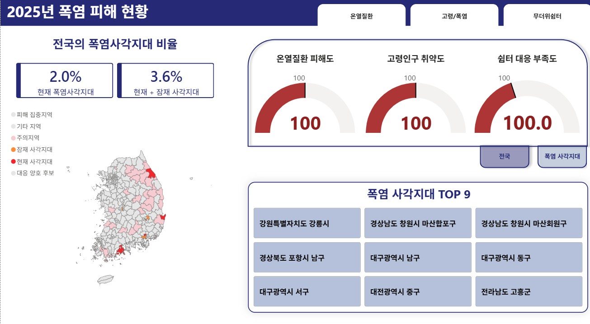
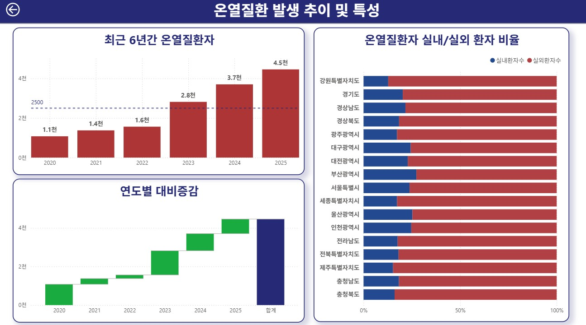
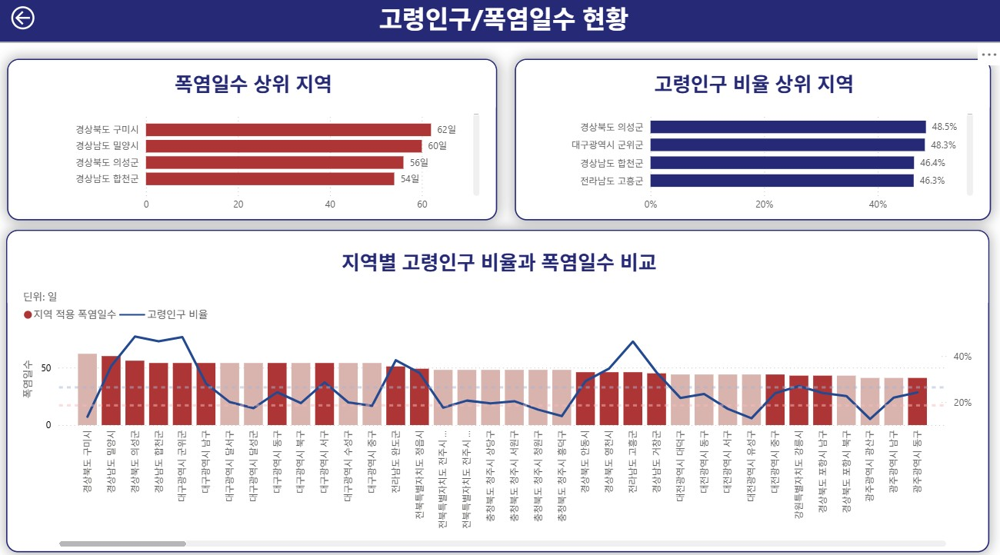
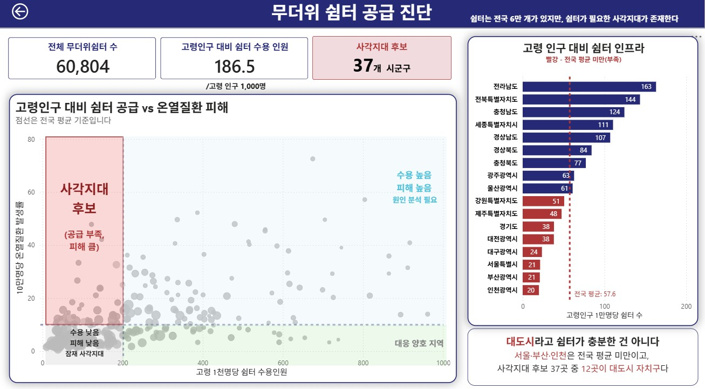

# 폭염 취약지역 분석 | Analysis Outputs

> 폭염 취약지역 및 무더위쉼터 사각지대 분석 프로젝트의  
> **Power BI 프로젝트 파일, 주요 시각화 결과, 발표자료**를 정리한 저장소입니다.

전체 프로젝트의 분석 배경, 데이터 구성, 전처리 및 상세 분석 과정은 아래 메인 저장소에서 확인할 수 있습니다.

🔗 **[전체 프로젝트 보기](https://github.com/hmh178-gif/heatwave)**

---

## 주요 시각화

### 01. 2025년 폭염 피해 현황



전국의 폭염 사각지대 비율과 주요 위험지역을 확인하고,  
온열질환 피해도·고령인구 취약도·쉼터 대응 부족도를 함께 비교했습니다.

---

### 02. 온열질환 발생 추이 및 특성



최근 6년간 온열질환자 발생 추이를 확인하고,  
지역별 실내·실외 온열질환자 비율을 비교했습니다.

---

### 03. 고령인구와 폭염일수 현황



폭염일수가 많은 지역과 고령인구 비율이 높은 지역을 확인하고,  
지역별 폭염일수와 고령인구 비율을 함께 비교했습니다.

---

### 04. 무더위쉼터 공급 진단



고령인구 대비 쉼터 수용 수준과 온열질환 피해를 함께 비교하여  
쉼터 공급이 부족하면서 피해 수준이 높은 사각지대 후보 지역을 확인했습니다.

---

## 발표자료

프로젝트의 분석 배경, 분석 과정 및 주요 결과를 정리한 최종 발표자료입니다.

- 📄 **[발표자료 PDF 보기](presentation/heatwave_presentation.pdf)**
- 📊 **[발표자료 PPTX 다운로드](presentation/heatwave_presentation.pptx)**

PDF 파일은 GitHub에서 바로 열어볼 수 있고,  
PPTX 파일은 원본 발표자료 확인 및 다운로드용으로 제공합니다.

---

## Power BI Project

본 프로젝트는 Power BI Project 형식인 `.pbip`로 저장했습니다.

Power BI Desktop에서 프로젝트를 확인하려면 아래 파일과 폴더를 함께 내려받아야 합니다.

```text
3조_최종.pbip
3조_최종.Report/
3조_최종.SemanticModel/
```

---

## Repository 구성

```text
heatwave-orange3/
├── README.md
├── images/
│   ├── 01_heatwave_overview.jpg
│   ├── 02_heat_illness_trend.jpg
│   ├── 03_elderly_heatwave_status.jpg
│   └── 04_shelter_supply_diagnosis.jpg
│
├── presentation/
│   ├── heatwave_presentation.pdf
│   └── heatwave_presentation.pptx
│
├── 3조_최종.pbip
├── 3조_최종.Report/
├── 3조_최종.SemanticModel/
└── .gitignore
```

---

## Files

| 경로 | 내용 |
|---|---|
| `3조_최종.pbip` | Power BI Project 실행 파일 |
| `3조_최종.Report/` | Power BI 보고서 정의 파일 |
| `3조_최종.SemanticModel/` | Power BI 데이터 모델 정의 파일 |
| `presentation/heatwave_presentation.pdf` | 발표자료 PDF |
| `presentation/heatwave_presentation.pptx` | 발표자료 PowerPoint 원본 |
| `images/` | 주요 대시보드 및 시각화 이미지 |

---

## Main Project

본 저장소는 **폭염 취약지역 및 무더위쉼터 사각지대 분석 프로젝트의 결과물 저장소**입니다.

분석 목적, 데이터 출처, 전처리 과정 및 상세 분석 내용은 아래 메인 프로젝트에서 확인할 수 있습니다.

➡️ **[Heatwave Analysis - Main Repository](https://github.com/hmh178-gif/heatwave)**
